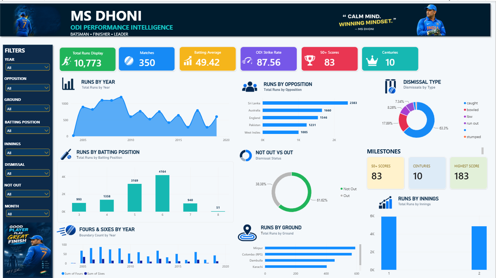

# MS Dhoni ODI Performance Intelligence Dashboard

An interactive Microsoft Power BI dashboard analyzing MS Dhoni's ODI career performance, batting trends, milestones, and key statistics.

## 📊 Project Overview

This project transforms MS Dhoni's ODI career statistics into an interactive and visually engaging Power BI dashboard.

The dashboard provides a comprehensive view of his performance across different years, opponents, batting positions, grounds, and dismissal types.

## 🎯 Key Insights

- Total ODI Runs
- Total Matches
- Batting Average
- Strike Rate
- 50+ Scores
- Centuries
- Runs by Year
- Runs by Opposition
- Performance by Batting Position
- Dismissal Analysis
- Not Out vs Out Analysis
- Runs by Ground
- Career Milestones

## 🛠️ Tools & Technologies

- Microsoft Power BI
- DAX
- Power Query
- Data Cleaning & Transformation
- Data Visualization
- Interactive Dashboard Design

## 📈 Dashboard Features

### Performance Overview
Provides a high-level summary of MS Dhoni's ODI career using key performance indicators.

### Year-wise Analysis
Visualizes changes in batting performance across different years of his ODI career.

### Opposition Analysis
Analyzes runs scored against different international opponents.

### Batting Position Analysis
Explores performance across different batting positions.

### Dismissal Analysis
Provides insights into dismissal patterns and the relationship between dismissals and innings.

### Ground Analysis
Highlights performance across different cricket grounds.

### Career Milestones
Showcases important milestones achieved throughout his ODI career.

## 📁 Project Files

| File | Description |
|------|-------------|
| `MS_Dhoni_ODI_Dashboard.pbix` | Power BI dashboard file |
| `MSDhoni_ODI_Stats.csv` | Dataset used for analysis |
| `dashboard-preview.png` | Dashboard preview image |
| `README.md` | Project documentation |

## 🚀 How to Use

1. Download or clone this repository.
2. Open `MS_Dhoni_ODI_Dashboard.pbix` using Microsoft Power BI Desktop.
3. If required, update the dataset path in Power Query.
4. Refresh the data.
5. Explore the interactive dashboard using the available filters and visuals.

## 💡 Skills Demonstrated

This project demonstrates practical skills in:

- Data Analysis
- Data Cleaning
- Data Transformation
- Data Modeling
- DAX
- Power Query
- Data Visualization
- Dashboard Development
- Data Storytelling

## 📌 Project Objective

The objective of this project is to demonstrate how cricket performance data can be transformed into meaningful insights using Microsoft Power BI.

## 👨‍💻 Author

**Sairam Chandu**

B.Tech CSE (AI & ML)

GitHub: [Sairam Chandu](https://github.com/sairamchandu7)

---

⭐ If you find this project useful, consider giving the repository a star.
